# 💸 Loan Default Prediction

This project is an end-to-end machine learning solution to predict whether a borrower will default on their loan. It uses real-world loan data and applies preprocessing, feature engineering, and classification techniques (Logistic Regression, Random Forest, and XGBoost) to build predictive models. The best-performing model is integrated into an interactive **Streamlit web application** that allows users to input loan applicant data and get real-time predictions. The project also includes visualizations, model explainability with SHAP, and a clean user interface.

---

## 📌 Features

- Cleaned real-world loan dataset
- Preprocessing, encoding, scaling, and PCA
- Multiple ML models with evaluation
- XGBoost model exported to JSON
- Streamlit Web UI for predictions

---

## 📂 Project Structure

```bash
Loan_Default_Prediction_Project/
│
├── app.py                   # Streamlit UI for prediction
├── eda.py                   # EDA + Preprocessing + Model training
├── model.py                 # ML models: Logistic, RF, XGBoost
├── cleaned_loan_data.csv    # Final cleaned dataset
├── loan_data_sample.csv     # Original raw data
├── xgb_model.json           # Trained XGBoost model
├── images/                  # Folder with all visualizations
├── README.md                # Project overview
```

---

## 🚀 How to Run

1. Install dependencies:
```bash
pip install -r requirements.txt
```

2. Run the Streamlit app:
```bash
streamlit run app.py
```

The app will run locally at: `http://localhost:8502`

---

## 🧠 Models Used

- Logistic Regression
- Random Forest
- XGBoost (Best performance)

**Evaluation Metrics:**
- Accuracy
- Precision, Recall
- Confusion Matrix
- ROC-AUC Curve

---

## 🌐 Streamlit UI

- Enter user inputs like income, FICO score, employment length, etc.
- Instantly get prediction: **Default** or **Not**
- Visual model performance metrics

---

## 📊 Application Screenshots & SHAP Visuals


### 📈 Correlation Heatmap
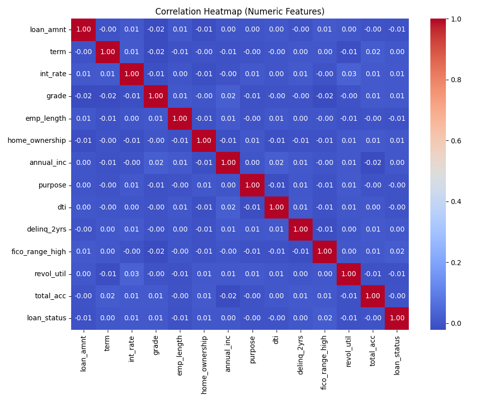

_Depicts correlation between features for feature selection._

---

### 📊 Class Balance in Dataset
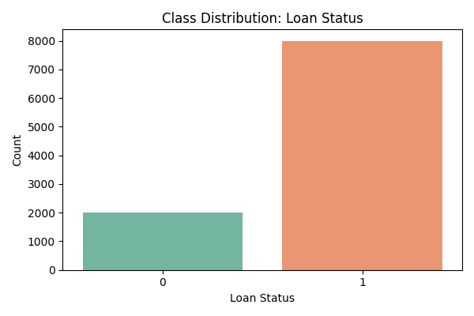

_Displays the ratio between defaulted and non-defaulted loans._

---

### 🎓 Loan Grade Distribution by Status
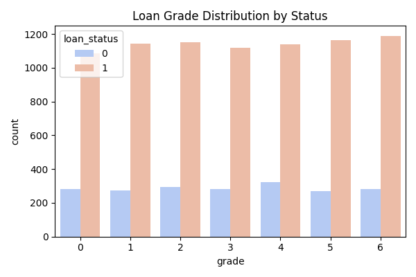

_Visualizes default rate by loan grade._

---

### 💰 Income Distribution by Loan Status
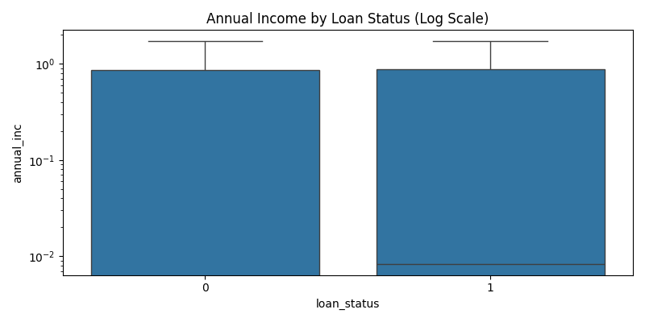

_Income comparison between defaulted and paid loans._

---

### 🧮 Interest Rate Distribution by Status
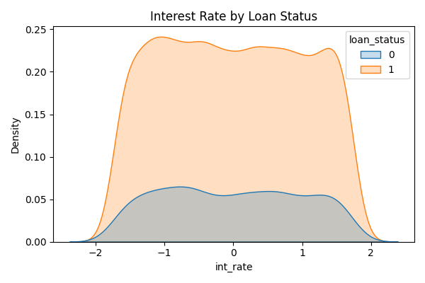

_Interest rate distribution by defaulted and non-defaulted loans._

---

### 💸 Loan Amount Distribution
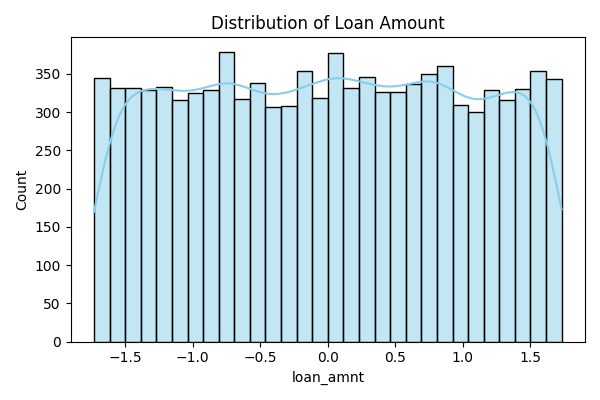

_Histogram of loan amounts in the dataset._

---

### 🏡 Loan Purpose by Status
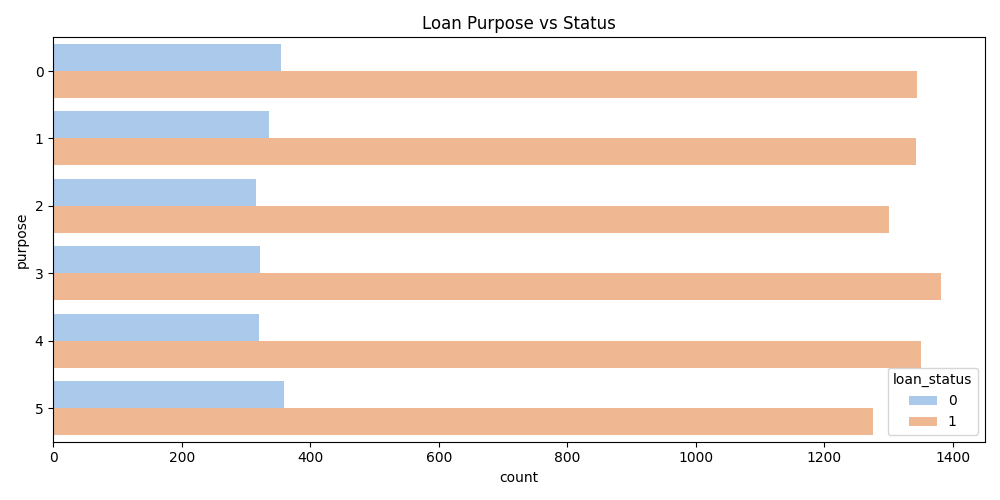

_Distribution of loan purposes and their default rates._

---

### ✅ Confusion Matrix – Logistic Regression
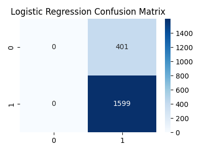

_Model performance visualized with true vs predicted labels._

---

### 🌲 Confusion Matrix – Random Forest


_Evaluation of Random Forest model's prediction accuracy._

---

### ⚡ Confusion Matrix – XGBoost
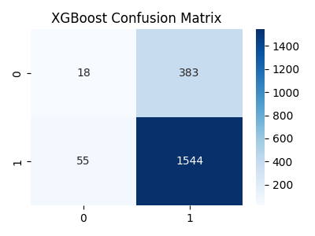

_Final model's confusion matrix using XGBoost classifier._

---
### 🖼️ UI Screen 1
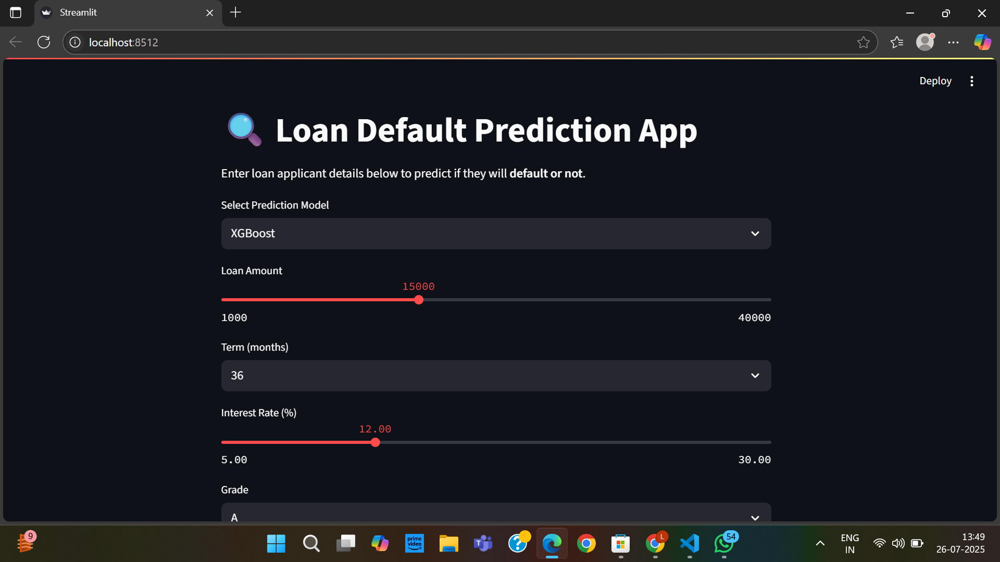  
_Streamlit form where users enter loan application details such as amount, income, FICO score, and purpose._

---

### 📊 UI Screen 2
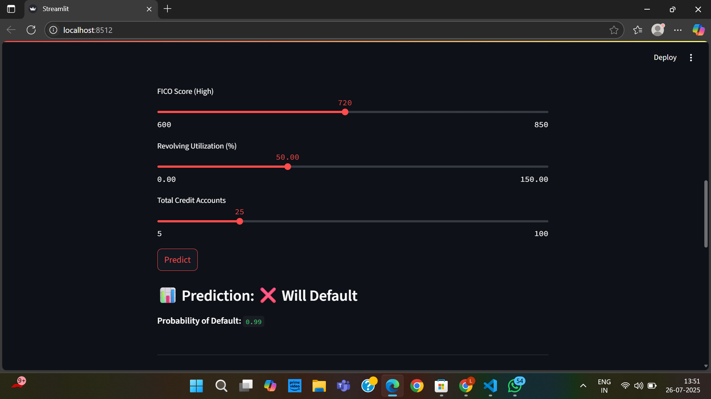  
_Output screen that displays the prediction (e.g., “Will Default”) along with model-selected probability scores._

---

### 📈 Power BI Dashboard
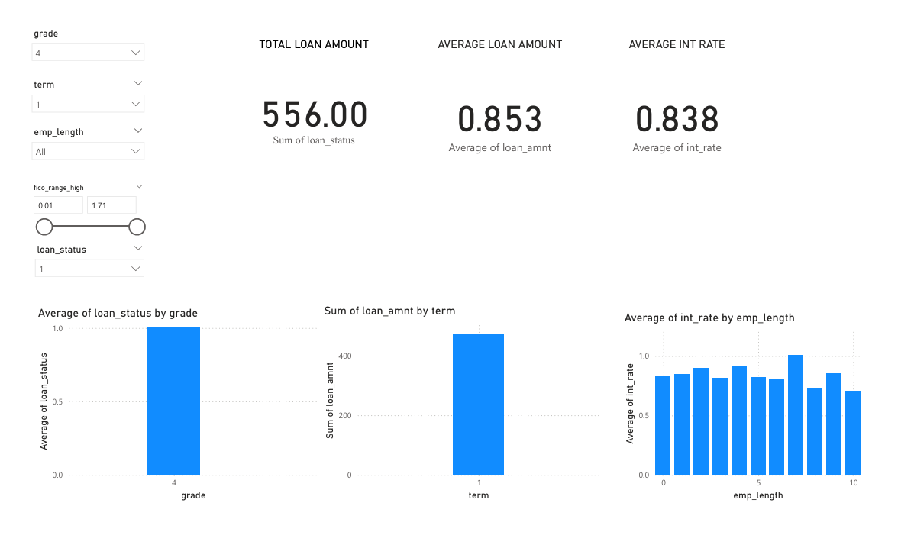  
_Interactive Power BI dashboard built from the cleaned dataset, showing trends, default ratios, and loan statistics._


## 📚 Future Enhancements

- Add SHAP/LIME explainability in UI
- Store predictions in SQLite or MongoDB
- Deploy with Docker or Heroku
- Build Power BI dashboards using `cleaned_loan_data.csv`
- Integrate email alerts for high-risk applications

---

## 🙋‍♀️ Author

**Lahari Sudhini**  

---


