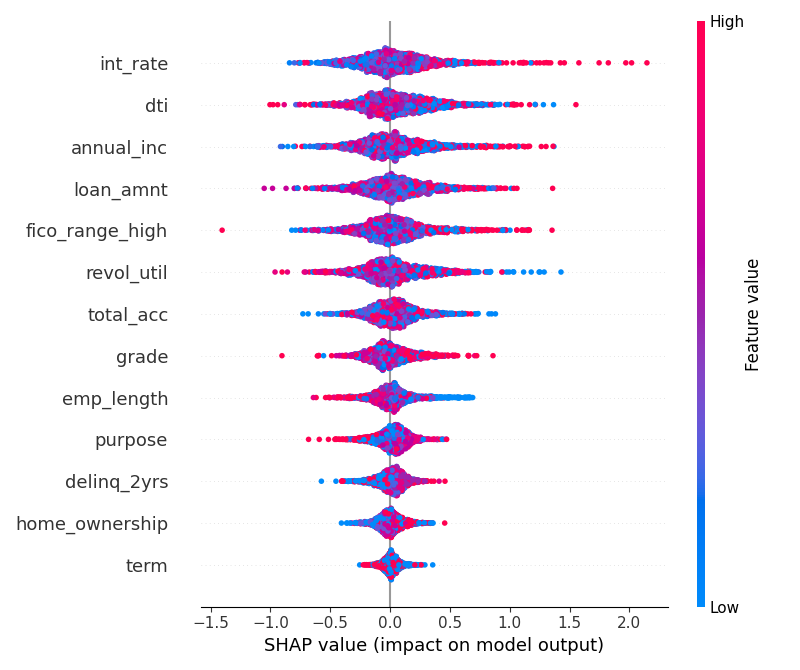

## 🔍 Loan Default Prediction Input Form  
  
_User interface where loan application details are input by the user._

---

## 🎯 Prediction Output with Probability  
  
_Output showing predicted result (“Will Default”) along with probability score._

---

## 💡 SHAP Summary Plot  
  
_Visual explanation of feature importance using SHAP values._

---

## 📈 Correlation Heatmap  
  
_Depicts correlation between features for feature selection._

---

## 📊 Class Balance in Dataset  
  
_Displays the ratio between defaulted and non-defaulted loans._

---

## 🎓 Loan Grade Distribution by Status  
  
_Visualizes default rate by loan grade._

---

## 💰 Income Distribution by Loan Status  
  
_Income comparison between defaulted and paid loans._

---

## 🧮 Interest Rate Distribution by Status  
  
_Interest rate distribution by defaulted and non-defaulted loans._

---

## 💸 Loan Amount Distribution  
  
_Histogram of loan amounts in the dataset._

---

## 🏡 Loan Purpose by Status  
  
_Distribution of loan purposes and their default rates._

---

## ✅ Confusion Matrix – Logistic Regression  
  
_Model performance visualized with true vs predicted labels._

---

## 🌲 Confusion Matrix – Random Forest  
  
_Evaluation of Random Forest model’s prediction accuracy._

---

## ⚡ Confusion Matrix – XGBoost  
  
_Final model's confusion matrix using XGBoost classifier._

---

## 🧠 SHAP Feature Importance Summary  
  
_Overall SHAP explanation showing top contributing features._

